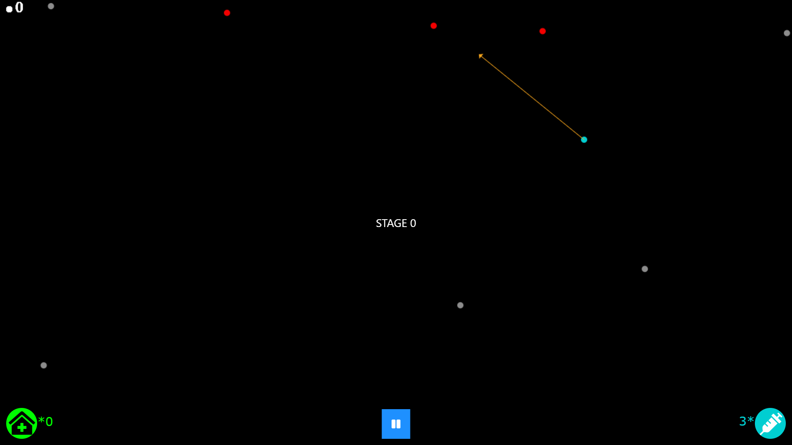

# Accelerating 2D "bouncing-balls" game using CUDA DSL
To accelerate a **2D balls-collision game** (designed initially in **JavaScript**, hosted online and was played **1000+** times), used **CUDA** (a design specific language to use Nvidia's GPU's as General Purpose GPUs) and accelerated it by **~1.5×**. This speedup is achieved by leveraging:
* Pinned memory, texture buffer for a **fast, dedicated buffer** memory-space
* Read/write coalescing for fast data access
* Ternary operator to reduce thread divergence
* Stream kernels to exploit the parallelism in game-construct
* **Atomically updated list for ball-states in each tile**
* Cache-efficient nested for-loop
* **nvprof profiler**
* **OpenGL** for graphics

After reading, implementing few other techniques for accelerating this game-construct, "**atomically updated list for ball-states in each tile**" approach seemed to be the **effective/optimal** approach.

## Dependencies
1. [Installing CUDA](https://docs.nvidia.com/cuda/cuda-installation-guide-linux/index.html)
2. [Installing OpenGL](https://medium.com/geekculture/a-beginners-guide-to-setup-opengl-in-linux-debian-2bfe02ccd1e) 
3. C++ 11
4. Libraries: `cudart`, `glut`, `GLU`, `GL`, `GLEW`

## Using the code
`final/final/main.cu` contains the **main program** which atomically updates ball states, updates ball dynamics in the buffer, draws the graphics on screen, etc.

1. Compile: `nvcc final/final/main.cu final/final/Postprocess.cu -o main.out -I /usr/local/cuda-10.1/targets/x86_64-linux/include/ -lcudart -lglut -lGLU -lGL -lGLEW`
2. Run: `./main.out`
3. Profiling: `./final/final/profile`

`final/final/Postprocess.cu` helps in coloring the background of the game and edge detection using **filter kernels**.

## Additional resources
1. Play the JS [game](https://covidchaos.github.io/), JS [Code](https://github.com/sundar7D0/covid-chaos)
2. [Slides](https://docs.google.com/presentation/d/1SjBRra2Wo6VOd1nS5jwRlU2aCEokyeq-LyCCo21CvDQ/edit?usp=sharing)
3. [GPU programming course content](http://www.cse.iitm.ac.in/~rupesh/teaching/gpu/jan20/)
